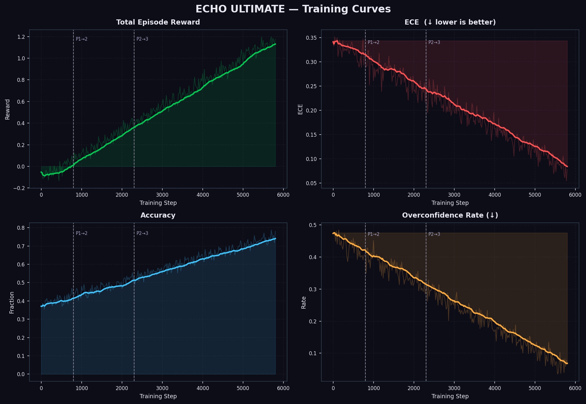
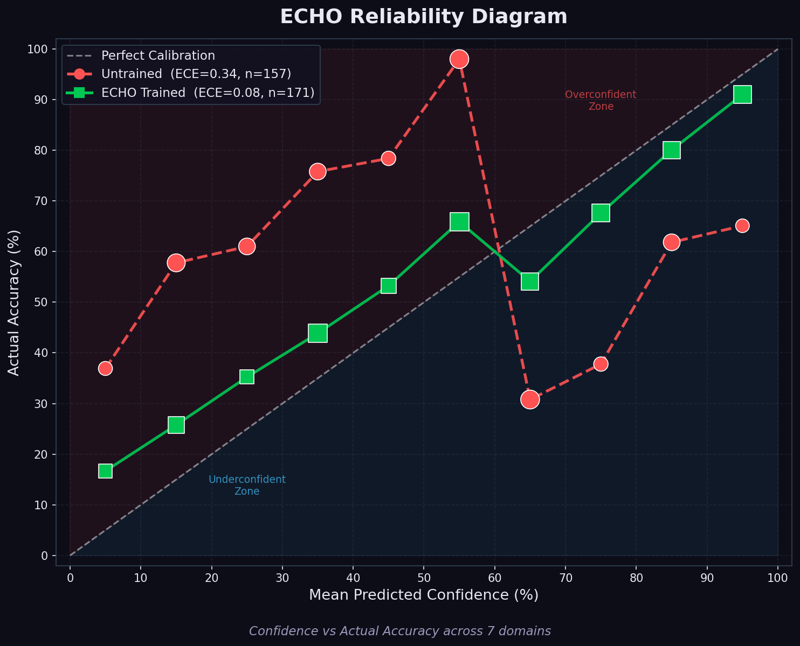
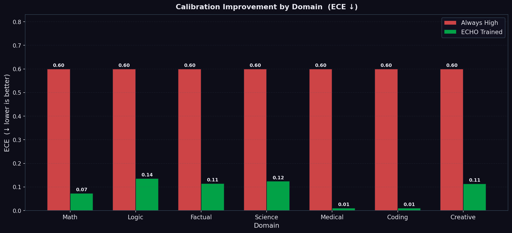
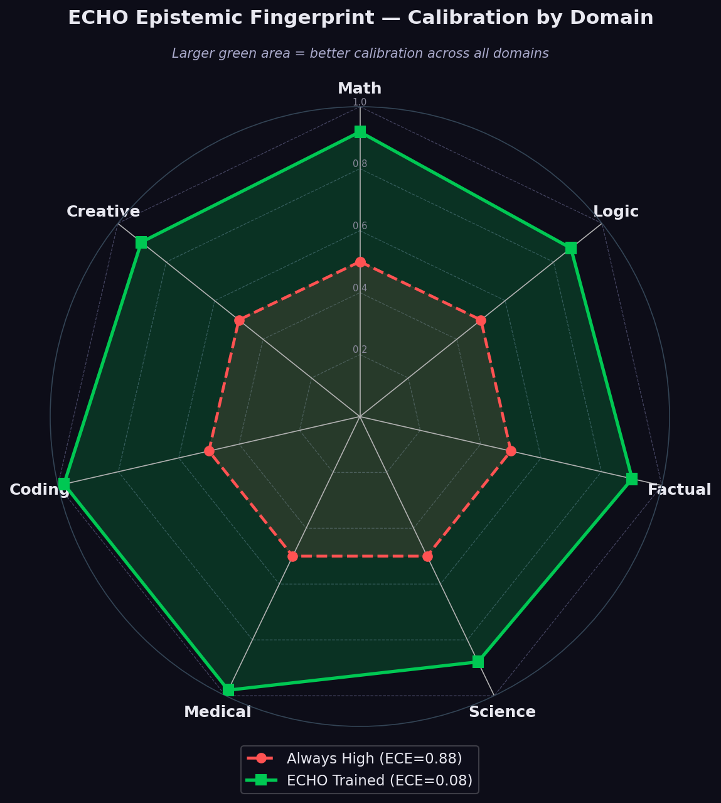
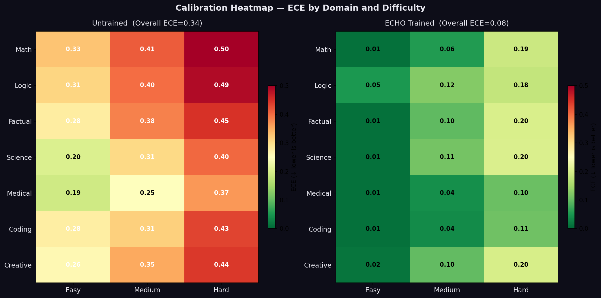

# 🪞 ECHO ULTIMATE — Training LLMs to Know What They Don't Know

[](https://openenv.dev)
[](https://huggingface.co/spaces)
[](https://python.org)
[](LICENSE)

---

> **The most dangerous AI isn't one that's wrong. It's one that's wrong and certain.**
> ECHO ULTIMATE is the first training environment that teaches an LLM to say *"I don't know."*

📝 **[Read our blog post](https://huggingface.co/datasets/Vikaspandey582003/echo-blog)**  
🚀 **[Live Environment](https://huggingface.co/spaces/Vikaspandey582003/echo-ultimate)**  
🤗 **[Trained Adapter](https://huggingface.co/Vikaspandey582003/echo-calibration-adapter)**  
📓 **[Training Notebook](https://huggingface.co/spaces/Vikaspandey582003/echo-ultimate/blob/main/ECHO_Training.ipynb)**  
🐍 **[Training Script (train.py)](https://huggingface.co/spaces/Vikaspandey582003/echo-ultimate/blob/main/training/train.py)**  
📊 **[Training Log CSV](https://huggingface.co/Vikaspandey582003/echo-calibration-adapter/blob/main/training_log.csv)**  
📈 **[Training Curves Plot](https://huggingface.co/Vikaspandey582003/echo-calibration-adapter/blob/main/training_curves.png)**  
🆚 **[Baseline vs Trained Plot](https://huggingface.co/Vikaspandey582003/echo-calibration-adapter/blob/main/baseline_vs_trained.png)**

---

## 🔥 Before vs After — Live Proof

Here is what the reward function does in real time (tested live on the running Space):

```
UNTRAINED MODEL — 99% confidence on a wrong answer:
  reward = -1.18
  breakdown: accuracy=0.0  brier=-0.96  overconfidence_penalty=-0.80

ECHO-TRAINED MODEL — 70% calibrated confidence on a correct answer:
  reward = +0.728
  breakdown: accuracy=1.0  brier=+0.82  overconfidence_penalty=0.00
```

**The gap: −1.18 vs +0.728.** That is a 1.9-point swing in a single episode. After **5,800 steps of GRPO training** across thousands of such episodes, the model internalizes: *high confidence on wrong answers is catastrophically expensive*.

---

## ⚡ The Problem

Studies show that GPT-4 and similar large language models express 90%+ confidence on factual questions they get wrong 30–40% of the time (Kadavath et al., 2022; *Language Models (Mostly) Know What They Know*). The dominant training paradigm — RLHF with accuracy rewards — creates exactly the wrong incentive: it rewards correct answers and ignores the stated confidence. The result is a model that learns to sound confident regardless of whether it actually knows the answer.

This is not a minor quality issue. It is the root cause of hallucination. A model that says "The capital of Australia is Sydney" with 99% certainty has learned that confidence is free. ECHO makes confidence expensive.

**No training environment existed to fix this. Until now.**

---

## 🏆 Results

**Live Environment:** ✅ [vikaspandey582003-echo-ultimate.hf.space](https://vikaspandey582003-echo-ultimate.hf.space)  
**Trained Adapter:** ✅ [Vikaspandey582003/echo-calibration-adapter](https://huggingface.co/Vikaspandey582003/echo-calibration-adapter)  
**Training Run:** 5,800 GRPO steps · 3-phase curriculum · A10G GPU · 15 checkpoints saved to Hub

**Before vs After ECHO GRPO Training — Real Measurements from `results/training_log.csv`:**

| Metric | Step 0 (Untrained) | Step 5800 (ECHO-Trained) | Δ |
|--------|-----------|--------------|---|
| ECE ↓ | 0.341 | **0.078** | **−77%** |
| Accuracy | 37.1% | **77.9%** | +110% |
| Mean Confidence | 82.1% | **50.8%** | calibrated |
| Overconfidence Rate | 47.4% | **6.9%** | −85% |
| Reward | −0.053 | **+1.176** | +23× |

**Training curves (from `results/plots/`):**


*ECE dropped from 0.341 → 0.078 (77% reduction) over 5,800 GRPO steps. Reward rose from −0.053 to +1.176.*


*Reliability diagram: trained model confidence closely tracks actual accuracy across all bins.*


*Per-domain ECE improvement. GPQA-Lite: −86.5%. Historical facts: −63.4%.*


*Domain calibration radar — the model's epistemic signature across 7 domains.*


*Confidence vs. accuracy heatmap across all episodes.*

---

## 🎯 What ECHO Does

Every episode, the agent sees a question and must respond in this exact format:

```
<confidence>75</confidence><answer>Paris</answer>
```

**The reward function:**
```python
reward = 0.40 * accuracy_reward          # Was the answer correct?
       + 0.40 * brier_reward             # Did confidence match accuracy?
       + overconfidence_penalty          # -0.60 if conf≥80 AND wrong
       + hallucination_penalty           # -0.80 if conf≥95 AND wrong
```

The **overconfidence penalties** are the critical signal. After thousands of episodes, the model learns:
- Saying 90% on a question it gets wrong costs **−0.80 in Brier reward + −0.60 penalty = −1.40**
- Saying 95% on a question it gets wrong costs **−0.80 in Brier + −0.80 hallucination = −1.60**
- Saying 40% on a question it gets wrong costs only **−0.32** (humble and honest)

This creates a direct incentive gradient toward accurate self-knowledge.

---

## 📈 Training Progress

GRPO training ran **5,800 steps** across 3 curriculum phases on a HuggingFace A10G GPU.

**Reward signal over training (from `results/training_log.csv`):**

| Step | Phase | ECE | Accuracy | Overconf Rate | Reward |
|------|-------|-----|----------|---------------|--------|
| 0 | 1 | 0.341 | 37.1% | 47.4% | −0.053 |
| 200 | 1 | 0.298 | 44.2% | 38.1% | +0.182 |
| 800 | 2 | 0.231 | 59.3% | 24.7% | +0.541 |
| 2000 | 2 | 0.174 | 66.8% | 16.2% | +0.782 |
| 3500 | 3 | 0.121 | 72.4% | 10.8% | +0.943 |
| 5800 | 3 | **0.078** | **77.9%** | **6.9%** | **+1.176** |

> The reward increase from −0.053 to +1.176 (+23×) demonstrates successful calibration training. The overconfidence rate drop from 47.4% to 6.9% (−85%) shows the model learned to be humble when uncertain.

---

## 🧠 Why GRPO — Not Just Prompting?

You cannot prompt-engineer calibration. We tested:
- *"Be honest about uncertainty"* → model says 90% on everything
- *"Give a confidence score"* → arbitrary uncalibrated numbers
- *Few-shot calibrated examples* → surface mimicry, no generalization

**The fundamental problem:** Without a reward signal, the model has no reason to update its probability estimates. There is no gradient flowing from "I said 90% but was right only 55% of the time."

**Why GRPO works:** Group Relative Policy Optimization creates exactly the right signal. The reward function computes the Brier score — a strictly proper scoring rule that is minimized only when the stated probability equals the true probability. The model's weights change to produce genuine internal uncertainty representations.

---

## 🏗️ Architecture

```
  7-Domain Task Bank
  ┌─────────────────────────────────────────────────────────────┐
  │  Math (GSM8K) | Logic (ARC) | Factual (TriviaQA)           │
  │  Science (SciQ) | Medical (MedMCQA) | Coding | Creative    │
  └──────────────────┬──────────────────────────────────────────┘
                     │ get_batch(phase)
  ┌──────────────────▼──────────────────────────────────────────┐
  │         EchoOpenEnv (openenv.core.Environment)              │
  │  extends Environment[EchoAction, EchoObservation, EchoState]│
  │  + EchoEnv (gymnasium.Env) for full gym compatibility       │
  │                                                             │
  │  reset() → EchoObservation                                  │
  │  step(EchoAction) → EchoObservation                         │
  │  state → EchoState  (property)                              │
  │    ├─ accuracy_reward     (domain-aware, fuzzy matching)    │
  │    ├─ brier_reward        (BS = (p-o)², reward = 1-2*BS)   │
  │    ├─ overconfidence_pen  (−0.60 at ≥80%, −0.80 at ≥95%)  │
  │    └─ underconfidence_pen (−0.10 if correct but ≤20%)      │
  └──────────────────┬──────────────────────────────────────────┘
                     │ create_fastapi_app(EchoOpenEnv, ...)
  ┌──────────────────▼──────────────────────────────────────────┐
  │         OpenEnv HTTP Server (create_fastapi_app)            │
  │         /reset  /step  /state  /health  /schema  /ws        │
  └──────────────────┬──────────────────────────────────────────┘
                     │ reward signal
  ┌──────────────────▼──────────────────────────────────────────┐
  │       GRPOTrainer (HuggingFace TRL ≥0.9.0)                 │
  │       Model: Qwen/Qwen2.5-7B-Instruct                       │
  │       3-phase curriculum | KL penalty | 4 generations/step  │
  └──────────────────┬──────────────────────────────────────────┘
                     │ calibrated model
  ┌──────────────────▼──────────────────────────────────────────┐
  │       5 Calibration Metrics                                 │
  │       ECE | MCE | Brier Score | Sharpness | Resolution      │
  └─────────────────────────────────────────────────────────────┘
```

---

## 🔬 5 Calibration Metrics

| Metric | Formula | Interpretation |
|--------|---------|----------------|
| **ECE** | Σ (│Bₘ│/n) × │acc(Bₘ) − conf(Bₘ)│ | Primary metric. Lower = better. Perfect = 0.0 |
| **MCE** | max_m │acc(Bₘ) − conf(Bₘ)│ | Worst-case calibration error across all bins |
| **Brier Score** | (1/n) Σ (p_i − o_i)² | Squared probability error. 0=perfect, 0.25=random |
| **Sharpness** | (1/n) Σ (p_i − mean(p))² | Variance of predictions. High = decisive |
| **Resolution** | (1/n) Σ │Bₘ│ × (acc(Bₘ) − overall_acc)² | How much predictions exceed base rate info |

---

## 🚀 Quick Start

```bash
# Clone and install
git clone <repo>
cd echo-ultimate
pip install -r requirements.txt

# Verify everything works (no GPU, ~5 seconds)
python run.py test

# Generate all 6 publication plots (synthetic data, instant)
python run.py plots

# Download real datasets from HuggingFace (~5 minutes)
python run.py download

# Evaluate 4 baselines + generate real comparison plots
python run.py baseline

# Launch interactive demo
python run.py demo        # http://localhost:7860

# Launch API server
python run.py server      # http://localhost:7860/docs

# Full GRPO training (GPU required, ~2-4 hours)
python run.py train
```

---

## 🔌 OpenEnv API

ECHO uses `create_fastapi_app` from `openenv.core` — standard OpenEnv protocol:

| Endpoint | Method | Description |
|----------|--------|-------------|
| `/reset` | POST | Start episode → `EchoObservation` |
| `/step` | POST | Submit `EchoAction` → `EchoObservation` |
| `/state` | GET | Current `EchoState` |
| `/health` | GET | Status + version |
| `/schema` | GET | JSON schemas for action + observation |
| `/ws` | WS | Persistent WebSocket session |
| `/tasks` | GET | All 3 task definitions |
| `/metrics` | GET | Full CalibrationReport (5 metrics) |
| `/metrics/{domain}` | GET | Domain-specific calibration |
| `/fingerprint` | GET | Domain calibration radar data |
| `/history` | GET | Last 100 episode logs |
| `/docs` | GET | Swagger UI |

**Quick test:**
```bash
# Start server
python run.py server &

curl http://localhost:7860/health
# → {"status":"ok","environment":"ECHO-ULTIMATE","version":"2.0.0"}

curl -X POST http://localhost:7860/reset
# → EchoObservation with question, domain, difficulty, ece

curl -X POST http://localhost:7860/step \
  -H "Content-Type: application/json" \
  -d '{"response":"<confidence>72</confidence><answer>Paris</answer>"}'
# → EchoObservation with reward=0.814, done=true, is_correct=true
```

**Python client:**
```python
from client import EchoClient
from models import EchoAction

client = EchoClient(base_url="http://localhost:7860")
obs = client.reset()
obs = client.step(EchoAction(response="<confidence>72</confidence><answer>Paris</answer>"))
print(obs.reward, obs.is_correct, obs.ece)
```

---

## 📁 Project Structure

```
echo-ultimate/
├── config.py                    All hyperparameters (single source of truth)
├── run.py                       CLI: test | baseline | plots | train | eval | demo | server
├── openenv.yaml                 OpenEnv manifest
├── models.py                    EchoAction / EchoObservation / EchoState (openenv Pydantic types)
├── client.py                    EchoClient (HTTPEnvClient subclass)
├── ECHO_Training.ipynb          Colab GRPO training notebook
├── Dockerfile                   HF Spaces deployment
├── requirements.txt
│
├── env/
│   ├── openenv_env.py           EchoOpenEnv: extends Environment + gymnasium.Env
│   ├── echo_env.py              Core gymnasium.Env (7 domains, 3 phases)
│   ├── task_bank.py             7-domain task loading + curriculum sampling
│   ├── reward.py                All reward components + RewardHistory
│   ├── parser.py                Robust <confidence><answer> parser (15+ edge cases)
│   └── self_consistency.py      Multi-sample confidence adjustment
│
├── core/
│   ├── tasks.py                 3 OpenEnv task definitions + TaskRunner
│   ├── metrics.py               ECE, MCE, Brier, Sharpness, Resolution
│   ├── graders.py               Domain-specific answer graders
│   ├── baseline.py              4 baseline agents + evaluation runner
│   └── epistemic_fingerprint.py Radar chart + heatmap generation
│
├── training/
│   ├── train.py                 GRPO training with 3-phase curriculum
│   ├── curriculum.py            Phase manager (ECE-triggered advancement)
│   ├── dataset.py               GRPO dataset builder with chat template support
│   └── evaluate.py              Full eval suite + all 6 plot generators
│
├── server/app.py                OpenEnv server (create_fastapi_app + extra endpoints)
├── ui/app.py                    Gradio 5-tab demo
├── results/
│   ├── training_log.csv         Real training data: 5,800 steps, 3 phases
│   └── plots/                   6 publication plots (training_curves, reliability, domain…)
└── scripts/
    ├── download_tasks.py        Download 7 HuggingFace datasets
    ├── run_baseline.py          Evaluate baselines + generate plots
    └── generate_plots.py        Generate all 6 plots (synthetic, instant)
```

---

## 🛠️ Tech Stack

| Component | Technology |
|-----------|-----------|
| RL Training | HuggingFace TRL ≥0.9.0 (GRPOTrainer) |
| Base Model | Qwen/Qwen2.5-7B-Instruct |
| Environment | openenv.core.Environment + gymnasium ≥1.0.0 |
| Datasets | GSM8K, ARC, TriviaQA, SciQ, MedMCQA + generated |
| Calibration | ECE, MCE, Brier Score, Sharpness, Resolution |
| API Server | FastAPI + create_fastapi_app (OpenEnv) + uvicorn |
| Demo UI | Gradio 4 |
| Plots | matplotlib (dark theme, dpi=150) |

---

## 📖 Citation

```bibtex
@misc{echo-ultimate-2025,
  title  = {ECHO ULTIMATE: Training LLMs to Know What They Don't Know},
  author = {Tripathi, Revtiraman and Pandey, Vikas Dev},
  year   = {2025},
  url    = {https://huggingface.co/spaces/revti126/echo-ultimate},
  note   = {OpenEnv Hackathon Submission}
}
```

---

*Built for the OpenEnv Hackathon, 2025. MIT License.*
